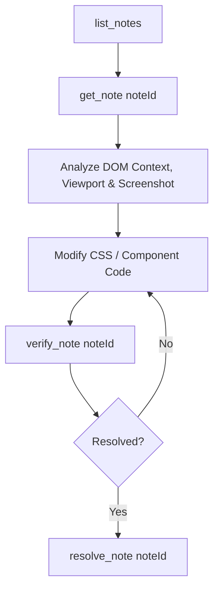

# BrowserTrack — AI Agent Guidelines & MCP Instructions

This repository is integrated with **BrowserTrack**, a local browser diagnostics daemon and Model Context Protocol (MCP) bridge. As an AI coding agent, you have direct access to live browser runtime errors, console logs, network failures, user breadcrumbs, visual notes, screenshots, and automated closed-loop verification tools.

---

## 🎯 When to Use BrowserTrack Tools

Always check BrowserTrack when:
1. **The user reports a bug, crash, or visual issue in the browser.**
2. **The user leaves visual annotations or design feedback** on elements/pages (Alt+Click notes).
3. **You modify frontend code** (React, Vue, HTML, CSS, JS) and need to verify whether runtime errors or visual regressions occurred.
4. **You need real-time page state, live DOM hierarchy, or screenshots** without asking the user to manually copy-paste logs or send screenshots.

---

## 🧭 Core Agent Workflows

### 1. Visual Notes & UI Fixes Workflow

When the user asks to fix a UI issue, layout bug, or style note:



1. **Find open notes:** Call `list_notes({ status: "OPEN" })`.
2. **Inspect note context:** Call `get_note({ noteId: "note_xxx" })`.
   - Review the target selector (`target.selector`), viewport dimensions, bounding box (`boundingRect`), and screenshot path.
   - Check if layout overflow (`overflow-x`, min-width, flex wrapping) is causing the issue.
3. **Apply the fix:** Edit the corresponding CSS, style rules, or component markup.
4. **Verify the fix:** Call `verify_note({ noteId: "note_xxx" })`.
   - This automatically reloads the browser, checks element visibility, tests viewport overflow, and captures an after-fix screenshot.
5. **Close the note:** If verified, call `resolve_note({ noteId: "note_xxx" })`.

---

### 2. Runtime Error & Crash Diagnostics Workflow

When an error or unexpected behavior occurs in the frontend:

1. **List open incidents:** Call `list_incidents({ status: "OPEN" })`.
2. **Retrieve incident details:** Call `get_incident({ incidentId: "inc_xxx" })`.
   - Inspect stack traces, exact source line/column, last user interactions, and failing network calls.
3. **Inspect interaction timeline (if needed):** Call `get_breadcrumbs({ incidentId: "inc_xxx" })` to see what clicks, inputs, or navigations led to the failure.
4. **Inspect failed network requests (if needed):** Call `get_network_failures()` to examine 4xx/5xx status codes, request URLs, and response details.
5. **Apply code fix:** Edit the source file causing the bug.
6. **Trigger closed-loop verification:** Call `verify_incident({ incidentId: "inc_xxx" })`.
   - Optionally supply `expect` probes (e.g. `[{ type: "no_incident" }, { type: "element_visible", selector: ".my-component" }]`).

---

## 🛠️ Complete MCP Tool Reference

### 📋 Incidents & Diagnostics
| MCP Tool | Purpose | Key Arguments |
| :--- | :--- | :--- |
| `list_incidents` | List grouped browser runtime errors and unhandled rejections | `status`, `severity`, `projectId`, `limit` |
| `get_incident` | Retrieve stack trace, breadcrumbs, screenshot, and context for an incident | `incidentId` *(required)* |
| `get_console` | Fetch recent console errors, warnings, and logs | `sessionId`, `limit` |
| `get_network_failures` | Fetch recent 4xx/5xx HTTP failures and aborted requests | `sessionId`, `limit` |
| `get_breadcrumbs` | Fetch chronological user interaction and navigation history | `incidentId`, `sessionId`, `limit` |
| `get_page_state` | Query current URL, document title, readyState, and active element | `sessionId` |
| `capture_element` | Capture an on-demand screenshot of a selector or full viewport | `selector`, `sessionId` |

### 📝 Visual Notes, Scenarios & Layout Inspector
| MCP Tool | Purpose | Key Arguments |
| :--- | :--- | :--- |
| `list_notes` | List visual annotations left on elements/regions | `status`, `projectId`, `scenarioId`, `limit` |
| `list_scenarios` | List multi-step reproduction flows and user scenarios | `status`, `projectId`, `limit` |
| `get_scenario` | Retrieve full chronological step-by-step reproduction flow | `scenarioId` *(required)* |
| `get_note` | Get full note details (DOM context, selector, bounding rect, screenshot) | `noteId` *(required)* |
| `capture_note_context` | Inspect live DOM bounding box, styles, and overflow on an element | `selector` *(required)*, `sessionId` |
| `verify_note` | Run automated layout verification and before/after comparison | `noteId` *(required)*, `observationWindowMs` |
| `get_note_verification`| Retrieve latest layout verification verdict and screenshots | `noteId` *(required)* |
| `resolve_note` | Mark a visual note as RESOLVED | `noteId` *(required)* |
| `reopen_note` | Reopen a previously resolved visual note | `noteId` *(required)* |

### 🎛️ Session & Project Management
| MCP Tool | Purpose | Key Arguments |
| :--- | :--- | :--- |
| `list_projects` | List all registered projects and mapped paths | *(none)* |
| `list_sessions` | List active browser tabs connected via WebSocket | `projectId`, `activeOnly` |
| `verify_incident` | Verify bug fix by reloading browser and evaluating probes | `incidentId` *(required)*, `expect`, `route` |
| `get_verification` | Retrieve verification verdict (`VERIFIED`, `FAILED`, `INCONCLUSIVE`) | `incidentId` *(required)* |

---

## ⚡ Quick Setup for Projects

If BrowserTrack is not yet active in your project:

### 1. Ensure Daemon is Running
```bash
browsertrack start
```

### 2. Connect the Browser Client
- **Via HTML script tag:**
  ```html
  <script src="http://127.0.0.1:7331/client.js"></script>
  ```
- **Or via NPM package:**
  ```typescript
  import 'browsertrack/client';
  ```

### 3. MCP Configuration
Ensure BrowserTrack MCP is configured in your editor:
```json
{
  "mcpServers": {
    "browsertrack": {
      "command": "browsertrack",
      "args": ["mcp"]
    }
  }
}
```

---

## 💡 Best Practices for AI Agents

- **Don't guess error causes:** Always check `get_incident` or `get_breadcrumbs` before modifying code.
- **Verify after fixing:** Call `verify_incident` or `verify_note` after code edits to confirm the fix works in the real browser.
- **Respect privacy redaction:** Passwords, auth tokens, and sensitive query parameters are redacted by BrowserTrack by design.
- **Check responsive viewports:** When resolving layout notes, observe the `viewport` dimensions reported in `get_note`.
