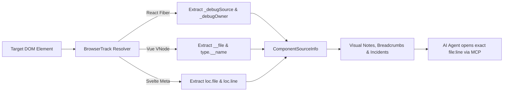

# Component & Source-Map Resolver 🧬

A core challenge for AI coding agents during frontend debugging is bridging the gap between what the browser renders (e.g., `<button class="sc-bdVaJa bDwzTH">`) and the actual source code file in the repository (e.g., `src/components/CheckoutButton.tsx:42`).

BrowserTrack includes an automated **Component & Source-Map Resolver** that inspects internal framework virtual DOM instances in real time and attaches exact component and source locations to visual notes, user interaction breadcrumbs, and error incidents.

---

## ⚡ Supported Frameworks

| Framework | Inspection Technique | Resolved Metadata |
| :--- | :--- | :--- |
| **React (v16–19)** | `__reactFiber$`, `_debugSource`, `_debugOwner` | Component Name, Source File, Line, Column, Component Hierarchy, Props |
| **Vue 3** | `__vueParentComponent`, `__vnode` | Component Name (`__name`), SFC File (`__file`), Hierarchy, Props |
| **Vue 2** | `__vue__.$options` | Component Tag, SFC File (`__file`) |
| **Svelte** | `__svelte_meta.loc` | Svelte Component Name, File Path, Line, Column |
| **Web Components** | Hyphenated custom element tags | Custom Element Tag Name |
| **Generic / Vanilla** | `data-component`, `data-source-file`, `data-source-line` | Explicit Component & File Annotation |

---

## 🔍 How It Works



### Development Mode Source Maps
Modern bundlers (Vite, Next.js, Create React App, Nuxt, SvelteKit) automatically populate `_debugSource` and `__file` on virtual DOM nodes during local development. BrowserTrack reads this data directly without requiring additional build plugins.

---

## 📦 Resolved Metadata Structure

Whenever a visual note is taken, or when user interactions precede a crash:

```typescript
export interface ComponentSourceInfo {
  framework?: 'react' | 'vue' | 'svelte' | 'web-component' | 'vanilla';
  componentName?: string;     // e.g. "CheckoutButton"
  sourceFile?: string;        // e.g. "src/components/CheckoutButton.tsx"
  sourceLine?: number;        // e.g. 42
  sourceColumn?: number;      // e.g. 8
  hierarchy?: string[];       // e.g. ["App", "ShopLayout", "CartDrawer", "CheckoutButton"]
  props?: Record<string, any>;// Sanitized component props
}
```

---

## 🤖 AI Agent MCP Usage

When an agent retrieves an incident or visual note:

### In `get_incident`:
The `lastInteractedElement` provides direct source coordinates:
```json
{
  "lastInteractedElement": {
    "selector": "button#checkout-btn",
    "tag": "button",
    "componentSource": {
      "framework": "react",
      "componentName": "CheckoutButton",
      "sourceFile": "src/components/CheckoutButton.tsx",
      "sourceLine": 42,
      "hierarchy": ["App", "ShopLayout", "CheckoutButton"]
    }
  }
}
```

### In `get_note`:
```json
{
  "elementContext": {
    "selector": ".user-profile-card",
    "componentSource": {
      "framework": "vue",
      "componentName": "UserProfileCard",
      "sourceFile": "src/components/UserProfileCard.vue"
    }
  }
}
```

The AI agent can immediately edit the exact file and line without running codebase searches or guessing CSS selectors!

---

## 🎨 Interactive Visual Badges in Browser

When inspecting elements or viewing saved notes on screen:
- The Note Editor modal displays a purple pill: `🧬 <CheckoutButton> (src/components/CheckoutButton.tsx:42)`.
- The Note Details Card popover displays the component badge and framework tag (`REACT`, `VUE`, `SVELTE`).
