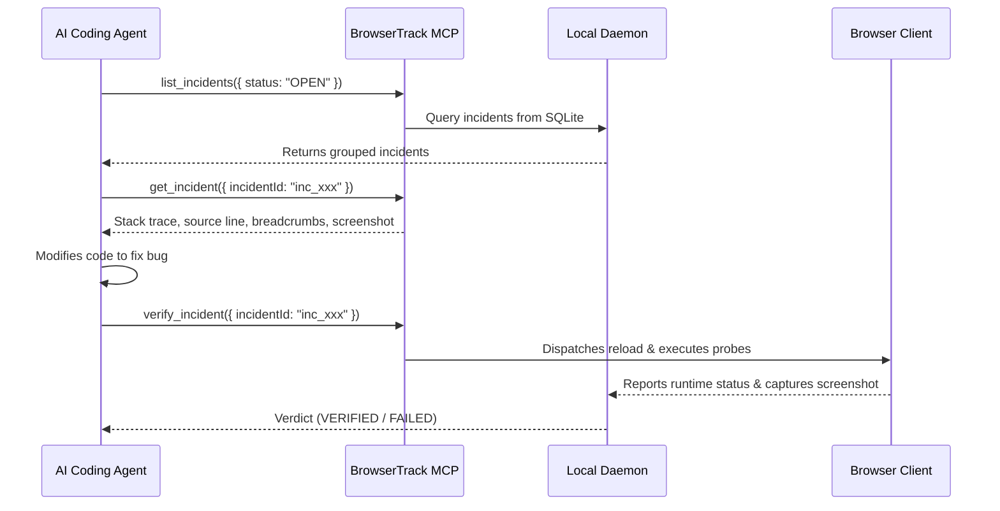

# Incidents & Diagnostics ⚠️

BrowserTrack continuously captures runtime errors, unhandled promise rejections, console warnings/errors, failed network calls, and user interaction breadcrumbs.

---

## ⚡ Automatic Error Grouping (Incidents)

Instead of overwhelming AI agents with duplicate errors, BrowserTrack uses intelligent fingerprinting:
- Grouped by `errorType`, normalized message, and source file line/column.
- Tracks `occurrences`, `firstSeen`, and `lastSeen` timestamps.
- Captures stack traces, route, and surrounding DOM state.

---

## 🍞 User Interaction Breadcrumbs

BrowserTrack maintains a bounded chronological timeline of events leading up to an error:
- **User Clicks**: Target selector, tag, text, and timestamp.
- **Form Focus/Blur**: Inputs engaged prior to crash (values are never recorded).
- **SPA & Browser Navigation**: `history.pushState` and URL route changes.
- **Console Logs**: `console.log`, `console.warn`, `console.error`.
- **Network Requests**: Method, URL, status code, and duration.

---

## 🌐 Network Failure Tracking

Failed HTTP requests (`4xx`, `5xx`, timeouts, and aborts) are captured with:
- Request method and sanitized URL (sensitive query parameters redacted by `@visulima/redact`).
- HTTP status code and response duration in ms.
- Error status and aborted flags.

---

## 🤖 Diagnostics Workflow for Coding Agents

