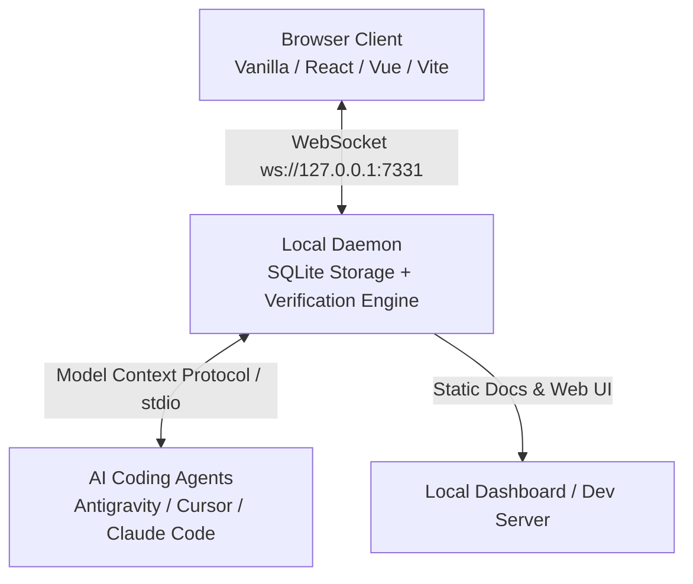

# BrowserTrack 🔍

> **Local browser diagnostics shared with AI coding agents through Model Context Protocol (MCP).**

BrowserTrack is a lightweight, framework-agnostic local development daemon and MCP bridge. It continuously captures browser runtime errors, unhandled promise rejections, console logs, network failures (4xx/5xx), user interaction breadcrumbs, live DOM snapshots, and visual design annotations—making them instantly accessible to AI coding assistants (Antigravity, Cursor, Claude Code, Windsurf) for autonomous debugging and closed-loop verification.

---

## ⚡ Why BrowserTrack?

Traditional browser debugging with AI coding agents relies on manual copy-pasting of truncated error messages or sending cropped screenshots. BrowserTrack removes the human in the middle:

- 🚀 **Real-time Diagnostics Pipeline**: Your browser communicates with the local daemon via WebSockets.
- 🎯 **Visual Annotations & Notes**: Hold <kbd>Alt</kbd> and click any element (or drag a region) to leave notes with DOM context and screenshots directly for coding agents.
- 📌 **Persistent On-Screen Markers**: Visual note pins appear directly on your web pages and can be inspected or resolved with a single click.
- 🤖 **Closed-Loop Verification**: After an agent edits your code, it automatically reloads the browser, executes verification probes, checks for regressions, and captures before/after screenshots.
- 🛡️ **Zero-Leak Security**: Integrated with `@visulima/redact` to automatically sanitize passwords, auth tokens, cookies, credit cards, and secret query parameters.

---

## 🏗️ Architecture Overview

---

## 🚀 Quick Navigation

- [Getting Started](./getting-started.md) — Quick installation and setup in under 2 minutes.
- [Visual Notes & Annotations](./visual-notes.md) — Screen notes, region selection, and persistent markers.
- [Multi-Step Scenarios & Flows](./scenarios-flows.md) — Sequential reproduction flows, Save & Next Step, and stepper walk-throughs.
- [Incidents & Error Diagnostics](./incidents-diagnostics.md) — Ingest runtime errors, stack traces, and breadcrumbs.
- [Closed-Loop Verification](./closed-loop-verification.md) — Automated bug-fix and layout verification.
- [MCP Tool Reference](./mcp-reference.md) — Complete guide to all MCP tools.
- [Security & Redaction](./security-privacy.md) — Privacy architecture and `@visulima/redact` integration.
- [CLI Reference](./cli.md) — Command-line interface usage.
