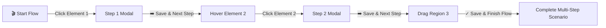

# Multi-Step Scenarios & Flows 🎬

BrowserTrack allows developers, testers, and designers to record sequential multi-step user reproduction scenarios (e.g., *"First I clicked this, then I entered this promo code, and here is where the price overflow occurred"*).

---

## ⚡ Continuous Recording Workflow (Save & Next Step)

Instead of manually reopening tools for each step, BrowserTrack provides a continuous capture loop:



1. **Start Recording**: Click **`🎬 Flow`** in the floating bottom-right dock (or click **`➡️ Save as Step 1 (Flow)`** from any note).
2. **Step Progression**:
   - Hover and click the first target element (or drag a region).
   - Enter your description/action.
   - Click **`➡️ Save & Next Step`** (or press <kbd>⌘+Enter</kbd> / <kbd>Ctrl+Enter</kbd>).
   - The step is saved instantly, the counter increments to Step 2, and the inspector automatically reactivates element inspection mode so you can immediately click the next element without touching the toolbar!
3. **Finish Recording**: On the final step, click **`✓ Save & Finish Flow`** or click the active **`🎬 Step N (Finish)`** button in the dock.

---

## 📌 Numbered Step Markers on Screen

When notes belong to a scenario:
- **Glowing Amber/Cyan Step Pins**: Displayed on target elements with **`🎬 Step 1`**, **`🎬 Step 2`**, **`🎬 Step 3`** badges.
- **Dynamic Anchoring**: Pins remain attached to elements during scrolling, viewport resizing, or SPA route transitions.

---

## 🔍 Interactive Stepper Walk-Through

Clicking any step pin opens the Note & Scenario Card:

- **Header**: Shows the scenario title and current step (e.g. `🎬 Step 2 of 4: Checkout Promo Flow`).
- **Sequential Stepper Bar**:
  - Click **`◀ Step 1`** to inspect the previous action.
  - Click **`Step 3 ▶`** to advance to the next action.
- **Actions**:
  - **`✅ Resolve Note`**: Mark individual steps as resolved.
  - **`🗑️ Delete`**: Delete single step.
  - **`🗑️ Delete Flow`**: Wipe the entire multi-step scenario from the database.

---

## 🤖 AI Coding Agent MCP Integration

AI agents can retrieve the full step-by-step reproduction journey using MCP tools:

### 1. `list_scenarios`
Lists all recorded scenarios for a project with total step counts and statuses.

### 2. `get_scenario`
Retrieves all ordered steps in chronological sequence with selectors, bounding boxes, routes, and screenshots.

```typescript
// Example agent query
const scenario = await client.callTool("get_scenario", {
  scenarioId: "scen_checkout_123"
});

// Returns:
// {
//   id: "scen_checkout_123",
//   title: "Checkout Promo Flow",
//   stepsCount: 3,
//   steps: [
//     { stepNumber: 1, type: "element", message: "Click Cart button", targetSelector: "#btn-cart", route: "/shop" },
//     { stepNumber: 2, type: "element", message: "Enter coupon PROMO", targetSelector: "#input-coupon", route: "/cart" },
//     { stepNumber: 3, type: "region", message: "Price overflow", route: "/cart", screenshot: "..." }
//   ]
// }
```
